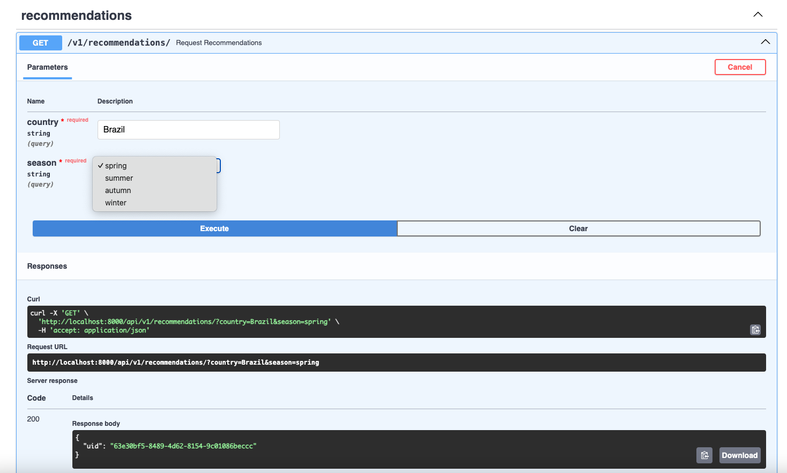
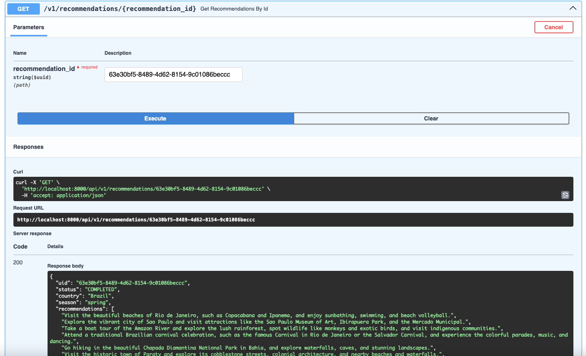
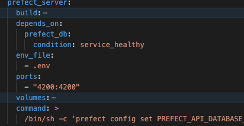
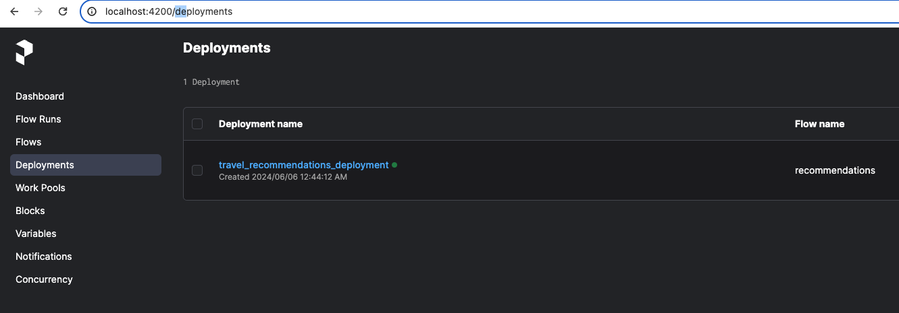

### TRAVEL RECOMMENDATION SYSTEM

This repository uses **OpenAI** to recommend places to visit in a country during a specific season.  
For example, if you want to go to Vietnam in the summer but are unsure about what **activities** to do,  
this repository will help you.

---

### How to setup and run

**TO RUN THIS REPO, YOU NEED DOCKER ON YOUR MACHINE**

#### 1. Modify the `.env` file.

This file contains environment variables to run this system. Rename or make a copy of the `.env.example` file to `.env` in case this file doesn't exist.  
Please enter your **OPENAI_API_KEY** (**important**).  
Modify other variables if needed.

---

#### 2. Build Docker images and run the application

In the root of the repository (where you can find the `docker-compose.yml` file):  
Run the `docker-compose build` command to build images.  
After the building process is complete, run all services defined in the `docker-compose.yml` file.  
Run the command `docker-compose up -d` to do that.

---

#### 3. Call the first API endpoint to see the result

On the browser, navigate to `/docs` or `/redoc` to read and make your requests.  
If in the `.env` file, `API_SERVER_PORT` is set to 3000, the URL will be `http://your-host:3000/docs`.

Make a request to get a recommendation:  

After you have the `uid` of your request, you can retrieve the answer after that.  

---

#### 4. Background jobs

We use Prefect for background jobs.  
If you want to access the Prefect dashboard, please map to port **4200** of the **Prefect** server.

After that, you can navigate to the **Prefect Dashboard**.  

---

